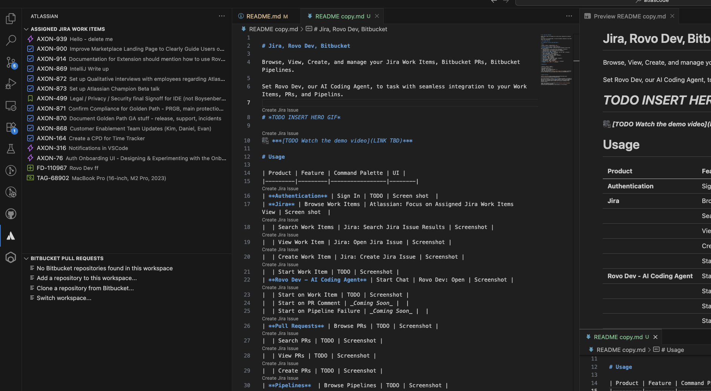

# Jira, Rovo Dev, Bitbucket

Browse, View, Create, and Manage your Jira Work Items, Bitbucket PRs, Bitbucket Pipelines. 

Use Rovo Dev, our AI Coding Agent, to task with seamless integration to your Work Items, PRs, and Pipelins.

# Get Started 
1. Install the extension from within VS Code (or a fork like Cursor or Windsurf) or download it from the marketplace.
2. Authenticate the extension with Atlassian
3. Open a Jira, View a PR, or ask Rovo Dev to work on something 
4. Try out all the features below. 
5. Check out TODO video for getting started 

# Usage 

| Product | Feature | Command Palette | UI |
|---------|---------|-----------------|--------|
| **Authentication** | Sign In | TODO | Screen shot  |
| **Jira** | Browse Work Items | Atlassian: Focus on Assigned Jira Work Items View | Screen shot  |
|  | Search Work Items | Jira: Search Jira Issue Results | Screenshot |
|  | View Work Item | Jira: Open Jira Issue | Screenshot |
|  | Create Work Item | Jira: Create Jira Issue | Screenshot |
|  | Start Work Item | TODO | Screenshot |
| **Rovo Dev - AI Coding Agent** | Start Chat | Rovo Dev: Open | Screenshot |
|  | Start on Work Item | TODO | Screenshot |
|  | Start on PR Comment | _Coming Soon_ |  |
|  | Start on Pipeline Failure | _Coming Soon_ |  |
| **Pull Requests** | Browse PRs | TODO | Screenshot |
|  | Search PRs | TODO | Screenshot |
|  | View PRs | TODO | Screenshot |
|  | Create PRs | TODO | Screenshot |
| **Pipelines**  | Browse Pipelines | TODO | Screenshot |
|  | Search Pipelines | TODO | Screenshot |
|  | View Pipelines | TODO | Screenshot |
|  | Run Pipelines | TODO | Screenshot |
| **Command Pallete** | Mac | `Cmd + Shift + P` | Screenshot
|  | Windows | `Ctrl + Shift + P` | Screenshot

# Troubleshooting 
If the table below doesn't help you, [raise an issue here.](https://github.com/atlassian/atlascode/issues?q=is%3Aissue%20state%3Aopen%20sort%3Aupdated-desc)

| Issue | Troubleshooting Steps |
|-------|----------------------|
| **Rovo Dev not working** | 1. Confirm you are on the latest stable release 2. Confirm you have an API token 3. Confirm the site on the API token has Rovo Dev enabled 4. Confirm you haven't run out of tokens 5. Try creating a new session 6. Try restarting your IDE 7. Try re-authenticating |
| **Jira Work Items not displaying** | 1. Confirm you are on the latest stable release 2. Try restarting the IDE 3. Try re-authenticating |
| **Bitbucket PRs not displaying** | 1. Confirm you are in a repo that uses Bitbucket as a remote 2. Confirm you are on the latest stable release 3. Try restarting the IDE 4. Try re-authenticating |
| **Bitbucket Pipelines not displaying** | 1. Confirm you are in a repo that uses Bitbucket as a remote 2. Confirm you are on the latest stable release 3. Try restarting the IDE 4. Try re-authenticating |
| **Authentication: Bitbucket/Jira Server failing to Authneticate** | 1. Confirm your server version is supported by the [Atlassian End of Support Policy](https://confluence.atlassian.com/support/atlassian-support-end-of-life-policy-201851003.html) 2. Confirm you are on the latest stable release 3. Try restarting the IDE 4. Try re-authenticating |

## Feature Release Notes 

As of now, Rovo Dev in VS Code (and it's forks) is only available for internal dogfooding (aka: Atlassian Employees).

# Compatibility

| Platform | Version | Support |
|----------|---------|---------|
| Jira Cloud | - | ✅ |
| Bitbucket Cloud | - | ✅ |
| Rovo Dev | via Jira Cloud API Tokens | ✅ |
| RDE / WSL | via API Tokens | Jira ✅, Bitbucket ❌ |
| Jira & Bitbucket Server | [Atlassian End of Support Policy](https://confluence.atlassian.com/support/atlassian-support-end-of-life-policy-201851003.html) | ✅

# Support & Billing 

[Raise an issue here.](https://github.com/atlassian/atlascode/issues?q=is%3Aissue%20state%3Aopen%20sort%3Aupdated-desc)

This VS Code extension is offered **free** of charge by Atlassian. It provides an additional user interface for some Atlassian Products, which is billed separately. Your use of any Atlassian Products remains subject to the Atlassian Customer Agreement. This extension does not modify your billing or licensing for any Atlassian Product.

Support and availability are available per the [Atlassian Customer Agreement](https://www.atlassian.com/legal/atlassian-customer-agreement#free-or-beta-products) for free products.

