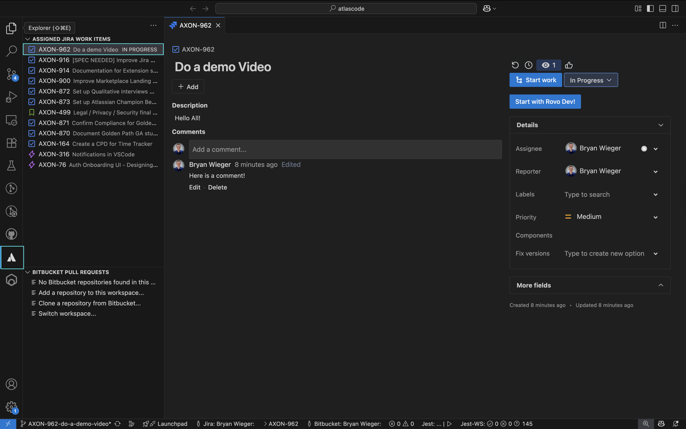
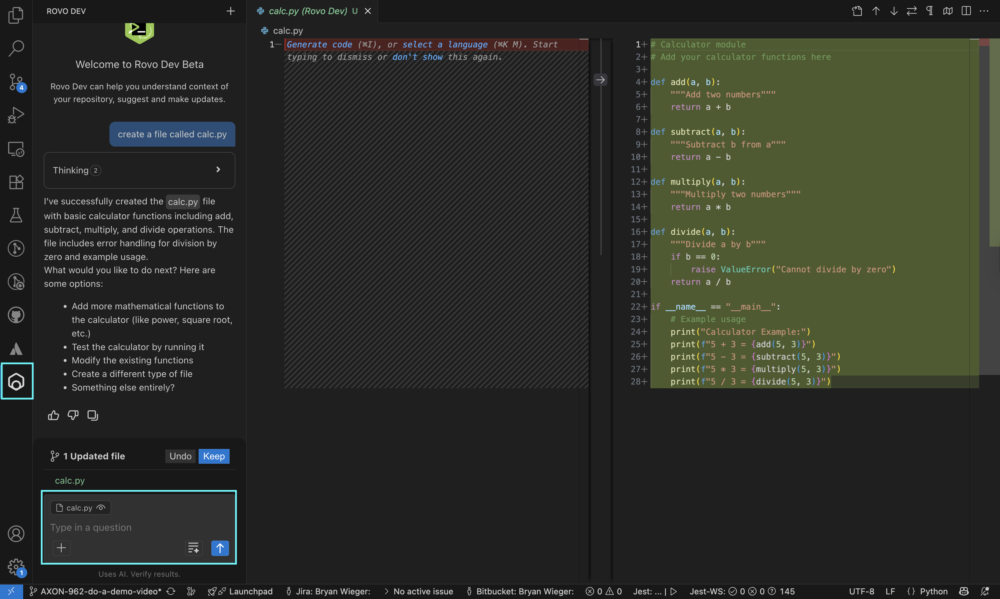
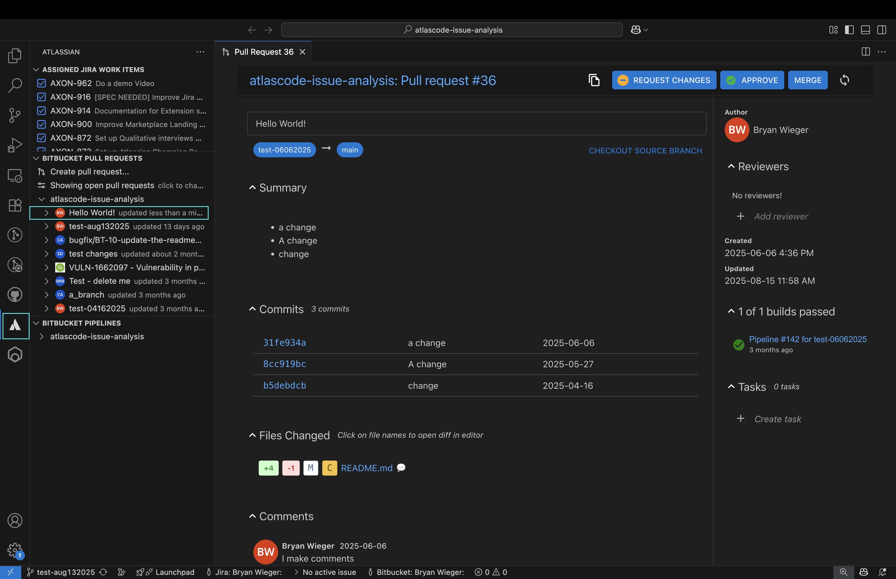

# Jira, Rovo Dev, Bitbucket

Stay in your IDE; don't switch contexts. 

Browse, View, Create, and Manage your Jira Work Items, Bitbucket PRs, Bitbucket Pipelines. 

Use Rovo Dev, our AI Coding Agent, to complete tasks, ask questions, and fix up PRs & Pipelines. 

## Jira

## Rovo Dev

## Bitbucket

# Get Started 
1. Install the extension (one click) 
2. Authenticate the extension with Atlassian 
3. Open a Jira, View a PR, or ask Rovo Dev to work on something  

# Usage 

| Product | Command Palette | Available Features |
|---------|-----------------|---------|
| **Authentication** | Atlassian: Open Settings | Sign in / Login |
| **Jira** | Jira:  | Browse, Search, View, Update, Create, and Start |
| **Rovo Dev - AI Coding Agent** | Rovo: | Ask questions, start on Jiras, write tests or documentation |
| **Pull Requests** | Bitbucket: | Browse, View, Update, Create, and Approve / Decline / Merge |
| **Pipelines**  | Bitbucket: | Browse, View, Run |

# Troubleshooting 
If the table below doesn't help you, [raise an issue here.](https://github.com/atlassian/atlascode/issues?q=is%3Aissue%20state%3Aopen%20sort%3Aupdated-desc)

| Issue | Troubleshooting Steps |
|-------|----------------------|
| **Rovo Dev not working** | 1. Confirm you are on the latest stable release 2. Confirm you have an API token 3. Confirm the site on the API token has Rovo Dev enabled 4. Confirm you haven't run out of tokens 5. Try creating a new session 6. Try restarting your IDE 7. Try re-authenticating |
| **Jira Work Items not displaying** | 1. Confirm you are on the latest stable release 2. Try restarting the IDE 3. Try re-authenticating |
| **Bitbucket PRs not displaying** | 1. Confirm you are in a repo that uses Bitbucket as a remote 2. Confirm you are on the latest stable release 3. Try restarting the IDE 4. Try re-authenticating |
| **Bitbucket Pipelines not displaying** | 1. Confirm you are in a repo that uses Bitbucket as a remote 2. Confirm you are on the latest stable release 3. Try restarting the IDE 4. Try re-authenticating |
| **Authentication: Bitbucket/Jira Server failing to Authneticate** | 1. Confirm your server version is supported by the [Atlassian End of Support Policy](https://confluence.atlassian.com/support/atlassian-support-end-of-life-policy-201851003.html) 2. Confirm you are on the latest stable release 3. Try restarting the IDE 4. Try re-authenticating |

## Feature Release Notes 

As of now, Rovo Dev in VS Code (and it's forks) is only available for internal dogfooding (aka: Atlassian Employees).

# Compatibility

| Platform | Version | Compatibility |
|----------|---------|---------|
| Jira Cloud | - | ✅ |
| Bitbucket Cloud | - | ✅ |
| Rovo Dev | via Jira Cloud API Tokens | ✅ - Atlassian Employees for now |
| RDE / WSL | via API Tokens | Jira ✅, Bitbucket ❌ |
| Jira & Bitbucket Server | [Atlassian End of Support Policy](https://confluence.atlassian.com/support/atlassian-support-end-of-life-policy-201851003.html) | ✅

